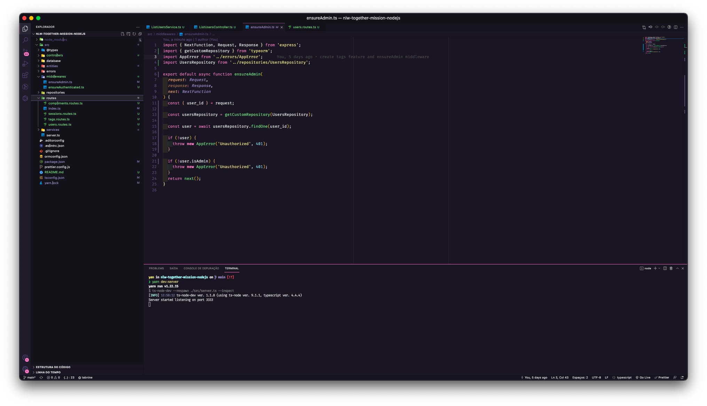

<h1>NLW Together - Valoriza API</h1>

  

## ✨ Tecnologias

Esse projeto foi desenvolvido com as seguintes tecnologias:

- [Node.js](https://nodejs.org/en/)
- [Typescript](https://www.typescriptlang.org/)
- [Express](https://expressjs.com/pt-br/)
- [JSONWebToken](https://github.com/auth0/node-jsonwebtoken#readme)

## 💻 Projeto

Valoriza é uma plataforma para promover o reconhecimento entre companheiros de equipe.

## 🚀 Como executar

- Clone o repositório
- Rode `yarn` para baixar as dependências
- Rode `yarn typeorm migration:run` para criar as tabelas do banco de dados.
- Rode o `yarn dev:server` para iniciar a aplicação.

Após isso, a aplicação estará disponível em `http://localhost:3333`
